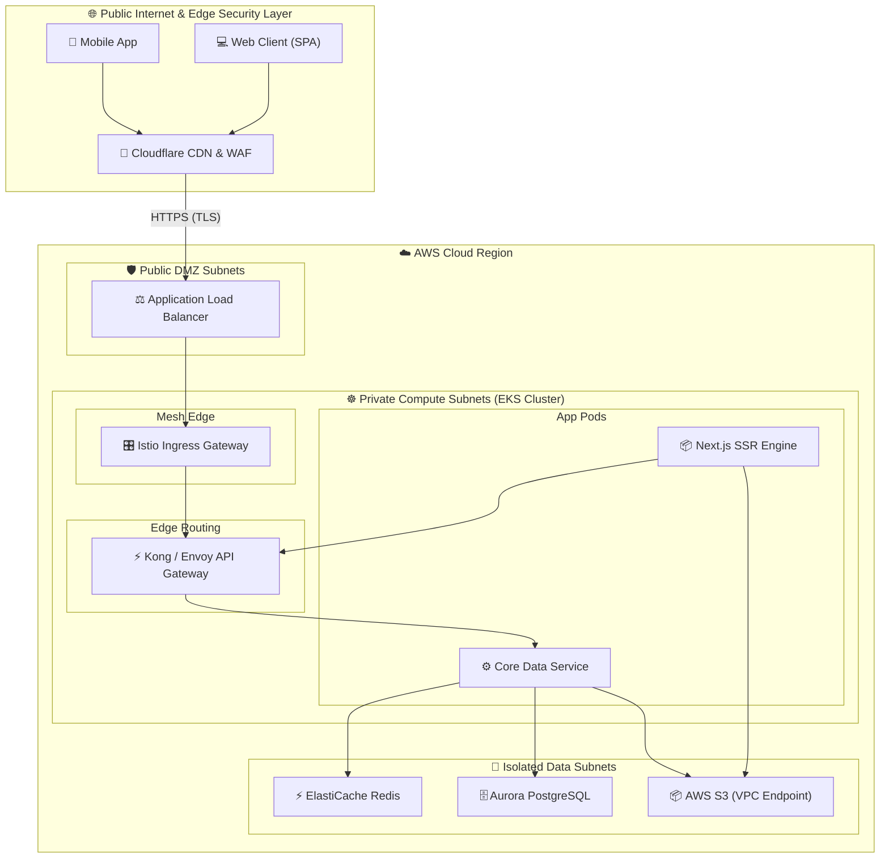

```mermaid
flowchart TB
    %% ==========================================
    %% TOP LEVEL PHYSICAL BOUNDARIES
    %% ==========================================
    subgraph EDGE ["🌐 Public Internet & Edge Security Layer"]
        direction LR
        Web["💻 Web Client (SPA)"]
        Mobile["📱 Mobile App"]
        Cloudflare["🚀 Cloudflare CDN & WAF"]

        Web & Mobile ---> Cloudflare
    end

    subgraph AWS ["☁️ AWS Cloud Region"]
        direction TB

        subgraph INGRESS_TIER ["🛡️ Public DMZ Subnets"]
            ALB["⚖️ Application Load Balancer"]
        end

        subgraph EKS_TIER ["☸️ Private Compute Subnets (EKS Cluster)"]
            direction TB

            subgraph INGRESS_MESH ["Mesh Edge"]
                Istio["🎛️ Istio Ingress Gateway"]
            end

            subgraph APP_ROUTING ["Edge Routing"]
                ApiGw["⚡ Kong / Envoy API Gateway"]
            end

            subgraph COMPUTE_NODES ["App Pods"]
                NextJS["📦 Next.js SSR Engine"]
                CoreSvc["⚙️ Core Data Service"]
            end

            Istio --> ApiGw
            NextJS --> ApiGw
            ApiGw --> CoreSvc
        end

        subgraph DATA_TIER ["💾 Isolated Data Subnets"]
            Redis["⚡ ElastiCache Redis"]
            RDS["🗄️ Aurora PostgreSQL"]
            S3["📦 AWS S3 (VPC Endpoint)"]
        end
    end

    %% ==========================================
    %% INTER-LAYER NETWORKING CROSSROADS
    %% ==========================================
    Cloudflare -- "HTTPS (TLS)" --> ALB
    ALB --> Istio

    %% Data Store Engagements
    CoreSvc --> Redis
    CoreSvc --> RDS
    NextJS & CoreSvc --> S3
```
