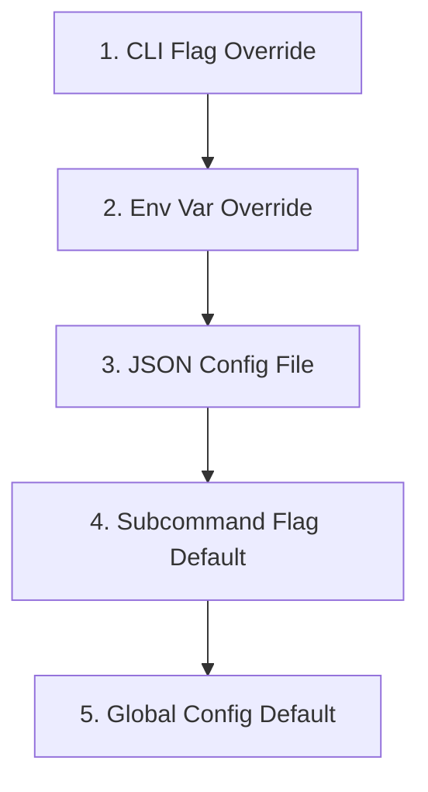

# med CLI

`med` is a lightweight, declarative, and type-safe CLI boilerplate framework built in TypeScript on Bun using `commander`.

It is the TypeScript port of [`dat267/min`](https://github.com/dat267/min), preserving the same opinionated layering: an identical configuration model, identical specificity resolution, and an identical `config` subcommand group, but built on Bun's runtime and commander's parser instead of Go and Kong.

It is designed to be completely reusable, allowing developers to add new subcommands or configuration properties by editing only TypeScript files.

## Features
- **Strict Override Specificity**: `CLI flag > Env Var > Config File > Subcommand Default > Root Default` resolved universally.
- **Root Command Cleanliness**: Config options are only exposed on subcommands that explicitly define them, preventing global option pollution on the root `--help` output.
- **Collision-Free Path Mapping**: Subcommand flags whose kebab-case name matches a flat global configuration key automatically inherit the full configuration hierarchy; non-matching flags stay local.
- **Vanilla TypeScript Type Safety**: `Config` is a plain TypeScript interface; defaults are static values; values flow through a typed resolver.
- **Cross-Platform Single Binary**: A GitHub Actions release workflow cross-compiles Bun standalone binaries for `linux/darwin/windows` across `amd64/arm64`.

---

## Prerequisites

[Bun](https://bun.com) `>=1.2` is required to build from source or run tests. Released binaries are self-contained and do not need Bun installed.

## Install

### From a release (recommended)

Download a prebuilt binary for your platform from the [latest release](https://github.com/dat267/med/releases/latest), then install it to a user-level location (no `sudo` or admin required). Available assets:

| Asset | Platform |
| :--- | :--- |
| `med-linux-amd64` | Linux x86_64 |
| `med-linux-arm64` | Linux ARM64 (Graviton, Raspberry Pi 4+, etc.) |
| `med-darwin-amd64` | macOS x86_64 (Intel) |
| `med-darwin-arm64` | macOS ARM64 (Apple Silicon) |
| `med-windows-amd64.exe` | Windows x86_64 |
| `med-windows-arm64.exe` | Windows ARM64 |

#### Linux

```sh
mkdir -p ~/.local/bin && curl -L -o ~/.local/bin/med https://github.com/dat267/med/releases/latest/download/med-linux-amd64 && chmod +x ~/.local/bin/med
```

`~/.local/bin` is on `$PATH` for most Linux distributions. If `med` is not found after opening a new shell, add it to your shell startup file (`~/.bashrc`, `~/.zshrc`, etc.):

```sh
export PATH="$HOME/.local/bin:$PATH"
```

#### macOS

```sh
mkdir -p ~/.local/bin && curl -L -o ~/.local/bin/med https://github.com/dat267/med/releases/latest/download/med-darwin-arm64 && chmod +x ~/.local/bin/med
```

`~/.local/bin` is **not** on `$PATH` by default on macOS. Add it to your shell startup file (`~/.zshrc` on modern macOS, `~/.bash_profile` on older) and open a new shell:

```sh
export PATH="$HOME/.local/bin:$PATH"
```

#### Windows (PowerShell)

```powershell
New-Item -ItemType Directory -Force -Path "$env:USERPROFILE\bin"; Invoke-WebRequest -OutFile "$env:USERPROFILE\bin\med.exe" https://github.com/dat267/med/releases/latest/download/med-windows-amd64.exe
```

`%USERPROFILE%\bin` is **not** on `$PATH` by default on Windows. Add it persistently and refresh the current shell:

```powershell
[Environment]::SetEnvironmentVariable("Path", $env:Path + ";$env:USERPROFILE\bin", "User"); $env:Path = "$env:USERPROFILE\bin;$env:Path"
```

Open a new PowerShell window after the first install so the persistent `Path` change is picked up. (Use `med-windows-arm64.exe` on Windows on ARM.)

### From source

```sh
git clone https://github.com/dat267/med.git && cd med && bun install && bun run build
```

To install the built binary to the same user-level location used above:

```sh
mkdir -p ~/.local/bin && mv ./bin/med ~/.local/bin/med    # Linux / macOS
# or on Windows PowerShell:
# New-Item -ItemType Directory -Force -Path "$env:USERPROFILE\bin"; Move-Item -Path .\bin\med.exe -Destination "$env:USERPROFILE\bin\med.exe"
```

---

## Developer Guide: Adding & Configuring Subcommands

This section explains how to add new subcommands, configure flags, and bind options to the global configuration.

### 1. How to Add a New Subcommand

Adding a subcommand involves three steps.

#### Step 1: Define the Command
Create a function or class representing the command. Commander wires flags and arguments inline at registration time; the command's behavior lives in a pure function in `src/commands/`.

```ts
// src/commands/diagnostic.ts
export interface DiagnosticOptions {
  verbose: boolean;
}

export function runDiagnostic(opts: DiagnosticOptions): void {
  if (opts.verbose) {
    console.log("Running verbose diagnostics...");
  }
  // ...
}
```

#### Step 2: Register the Subcommand
Wire it into the root program in `src/cli.ts`. Options that share a kebab-case name with a global config key are passed into the framework's resolver via the action's `this.getOptionValueSource(...)` so that only CLI-explicit values override env/file/sub-defaults.

```ts
program
  .command("diagnostic")
  .description("Run system diagnostic suite")
  .option("-v, --verbose", "Enable verbose diagnostic output.")
  .action((opts: { verbose?: boolean }) => {
    runDiagnostic({ verbose: Boolean(opts.verbose) });
  });
```

#### Step 3: (Optional) Bind to Global Config
If you want the subcommand to expose a global config key as a flag, name the option to match the global flat key in `kebab-case`. For example, to expose `core.timeout`, register the option as `--core-timeout <duration>`. The framework automatically walks the precedence chain for it.

```ts
const ctx = buildContext(program, appName, true, {
  subDefaults: { "core-timeout": opts.coreTimeout ?? "10s" },
  cliValues:   { "core-timeout": opts.coreTimeout ?? "10s" },
  cliSource:   { "core-timeout": this.getOptionValueSource("coreTimeout") === "cli" },
});
console.log(`timeout is ${ctx.resolved["core-timeout"].value}`);
```

---

### 2. Commander API Cheat Sheet

Commander uses a fluent, imperative API rather than struct tags. The reference below maps common Kong tags to their commander equivalents in this codebase.

| Kong Tag         | Commander Equivalent                                         | Example                                       |
| :--------------- | :----------------------------------------------------------- | :-------------------------------------------- |
| `cmd:""`         | `program.command("<name>")`                                  | `program.command("greet")`                    |
| `arg:""`         | `command.argument("[name]", "desc", defaultValue)`           | `.argument("[name]", "...", "World")`         |
| `help:"..."`     | `command.description("...")` or `.option(flag, desc)`        | `.description("Print a greeting message")`    |
| `default:"..."`  | `.option(flag, desc, defaultValue)`                          | `.option("-t, --times <n>", "...", "1")`      |
| `short:"s"`      | Short flag declared inline: `"-s, --shout"`                  | `.option("-s, --shout", "...")`               |
| `placeholder:"X"`| The placeholder appears automatically from `<X>` in the flag | `.option("--config-file <PATH>", "...")`      |
| `required:""`    | `.requiredOption(flag, desc)`                                | `.requiredOption("--token <t>", "...")`       |
| `xor:"group"`    | Not built-in; enforce in your action handler                 | -                                             |
| `name:"json-out"`| The kebab-case name is derived from the flag declaration     | `.option("--json-out <path>", "...")`         |

---

### 3. Configuration & Specificity Precedence

The global configuration is declared in `src/config/schema.ts` as a typed `Config` interface plus a `flatKeys` registry that maps each kebab-case flat key to a `FieldSpec` (`{ type, default }`).

Any subcommand option whose kebab-case name appears in `flatKeys` automatically participates in the configuration hierarchy.

The priority order is strictly resolved as follows:



#### Flag Name and Path Mapping
The framework maps subcommand options to global configuration properties by exact kebab-case match:
- If the global `Config.Core.Timeout` is registered under the flat key `"core-timeout"`, then a subcommand option declared as `--core-timeout <duration>` maps to it. The env var is `MED_CORE_TIMEOUT`.
- Any subcommand option whose name does not match a global flat key (e.g. a local `--times <n>` flag on `greet`) remains entirely local to the subcommand and does not conflict with the global configuration.

#### Crucial: Field Naming Rules
Because the framework maps subcommand flags by name, **the flag you register on a subcommand must match the kebab-case flat key of the target global configuration property**:
- To bind to global `Config.Core.Timeout` (flat key `"core-timeout"`), the subcommand option **must be `--core-timeout <duration>`**. Commander will expose it under the attribute name `coreTimeout`; the action handler uses this name with `getOptionValueSource("coreTimeout")` to detect whether the user set it explicitly.
- If you register it as `--timeout <duration>`, the framework will not match the global key, and the flag will act only as a local command flag with no env-var or config-file inheritance.

#### Duplicate Key Detection
To ensure configuration integrity, the framework enforces unique leaf-level paths within the JSON configuration file:
- If the configuration file defines the same setting in multiple forms (e.g. including flat `"core-timeout": "5m"` at the root level and nested `"core": {"timeout": "10m"}`), the parser will fail immediately with a validation error:
  `error: duplicate config keys in /home/dat/.config/med/med.json: both "core-timeout" and "core.timeout" are defined. Run 'med config edit' to fix this.`

---

## Quick Start

```sh
# Once installed:
med --help
med config init --force
med config show
med greet --core-timeout 5m Alice
```

## Test

```sh
bun test
```

The test suite (`tests/cli.test.ts`) auto-builds the binary and exercises 14 scenarios mirroring `min`'s specificity test suite, including explicit zero/empty preservation edge cases and duplicate-key validation.

## Releasing

Push to `main` (or trigger `workflow_dispatch`) to publish cross-platform binaries via the GitHub Actions release workflow in `.github/workflows/release.yml`. Each release is tagged `${BIN_NAME}/${SHORT_SHA}` and the last `KEEP_RELEASES` (default 3) are retained.
